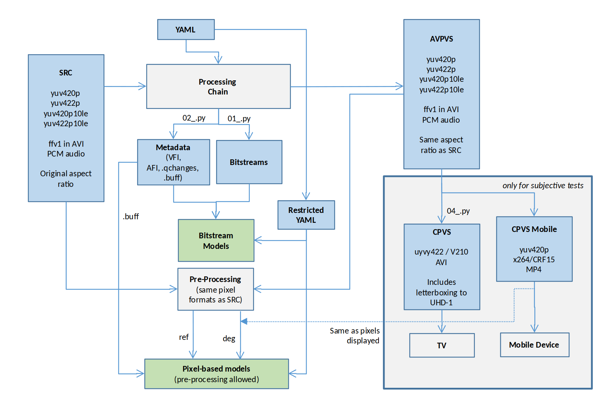

# AVHD-AS / P.NATS Phase 2 Processing Chain

This is the processing chain used to generate sequences for the P.NATS Phase 2 / AHVD-AS project from ITU-T SG12 and VQEG.

> ⚠️ **Note:** This is an updated version of the chain using the newest dependencies from Ubuntu 20.04, and ffmpeg 4.3. It does not reflect what was used in the project at the time. To use that instead, please switch to the `master` branch.

Table of contents:

- [Installation](#installation)
- [Overview](#overview)
- [Test configuration](#test_configuration)
- [Usage](#usage)
- [Acknowledgement](#acknowledgement)
- [Contributors](#contributors)
- [License](#license)

## Overview

The processing chain is capable of taking in raw video, and producing the following:

- Coded video/audio bitstreams, for use with bitstream-based models
- Metadata files, for use with metadata-based models
- Raw video files, for use witn pixel-based models
- Compressed video files, for use with subjective tests

It can encode video with:

- H.264/MPEG-4 Part 10 (x264)
- H.265/MPEG-H Part 2 (x265)
- VP9 (libvpx-vp9)

## Installation

You need:

- Python 3.8
- Linux (tested with Ubuntu 20.04)
- The `ffmpeg` and `ffprobe` binaries placed in your `$PATH`

Install the current Python package requirements by running:

```
pip3 install --user poetry
poetry install
```

## Test configuration

The processing chain requires a YAML file that specifies the input files and settings to use for generating output sequences.

A sample database is available at: https://github.com/pnats2avhd/example-databases

Some general definitions:

- A database is a collection of PVSes (Processed Video Sequences)
- A PVS is a combination of SRC and HRC (Hypothetical Reference Circuit)
- PVS, SRC and HRC IDs must be unique over all databases (SRC/HRC IDs can be identified across databases)
- A PVS file processed for being read by a pixel-based model is called AVPVS
- A PVS file shown in a particular context is a CPVS (Context Processed Video Sequence)

## Usage

Run the processing chain, pointing to the test config file, by executing the `p00_processAll.py` script, or the four individual scripts in order.

These scripts are the following:

- `./p00_processAll.py`: Run all the processing steps.
- `./p01_generateSegments.py`: Generate the segment(s) for each PVS in the test config. This performs the actual bitstream encoding.
- `./p02_generateMetadata.py`: Generate all the metadata files described in the *Module Interfaces* document, specific for the PNATS phase 2 project.
- `./p03_generateAvPvs.py`: Generate the PVS that will be input to FR models, i.e. by upscaling and decoding the segments into raw video and by (optionally, for long tests) concatenating them
- `./p04_generateCpvs.py`: Generate the PVS that will be shown to the subjects, depending on the output context (PC, mobile, tablet)

An overview of the architecture can be seen here, where the individual scripts are marked as `0x_.py` for brevity:



You can clone the example databases and process them like so:

```
git clone https://github.com/pnats2avhd/example-databases
./p00_processAll.py -c example-databases/P2SXM00/P2SXM00.yaml
```

### Detailed CLI Options

To run the processing chain, find the individual command usage here:

```
./p00_processAll.py -c TEST_CONFIG [-fvnphr|--filter-src|--filter-hrc|--filter-pvs]
./p01_generateSegments.py -c TEST_CONFIG [-fvnphr|--filter-src|--filter-hrc|--filter-pvs]
./p02_generateMetadata.py -c TEST_CONFIG [-fvnphr|--filter-src|--filter-hrc|--filter-pvs]
./p03_generateAvPvs.py -c TEST_CONFIG [-fvnphrs|--filter-src|--filter-hrc|--filter-pvs|--spinner-path]
./p04_generateCpvs.py -c TEST_CONFIG [-fvnphre|--filter-src|--filter-hrc|--filter-pvs|--preview-enc]
```

The arguments common to all scripts are:

- `-c`, `--test-config`: path to test config file at the root of the database folder (required)
- `-f`, `--force`: force overwrite existing output files
- `-v`, `--verbose`: print more verbose output
- `-n`, `--dry-run`: only print commands, do not run them
- `-p`, `--parallelism`: number of processes to start in parallel (use more if you have more RAM/CPU cores)
- `-r`, `--remove-intermediate`: remove/delete intermediate and temporary files
- `-h`: print help message
- `--filter-src`: Only create specified SRC-IDs. Separate multiple IDs by a '|'
- `--filter-hrc`: Only create specified HRC-IDs. Separate multiple IDs by a '|'
- `--filter-pvs`: Only create specified PVS-IDs. Separate multiple IDs by a '|'

Some scripts have unique arguments:

- `p01_generateSegments.py`:
    - `-sos`, `--skip-online-services`: skip videos coded by online services (default: `False`)
- `p03_generateAvPvs.py`:
    - `-s`, `--spinner-path`: optional path to a spinner animation to be used when creating stalling events. Default: `./util/5.png`
- `p04_generateCpvs.py`:
    - `-a`, `--rawvideo`: use rawvideo as output
    - `-e`, `--lightweight-preview`: create lightweight preview files

### Docker

See  `docker/README.md` for more info.

## Acknowledgement

<<<<<<< HEAD
If you use this software in your research and/or for publications, please link back to the URL of this repository.  

Here is a suggested citation in BibTeX format

```BiBTex
@misc{pnats_processing_chain,
  author="Robitza, Werner and Lindero, David and Borer, Silvio and Satti, Shahid and Göring, Steve and Müller, Martin and Ramachandra Rao, Rakesh Rao",
  title="Video Degradation Processing Chain",
  year=2020,
  url=https://github.com/pnats2avhd/processing-chain/,
  note = "[Online; accessed 2021-04-28]"
```

## Contributors

Maintainers:

- David Lindero, Ericsson – <david.lindero@ericsson.com>
- Werner Robitza, AVEQ GmbH – <werner.robitza@gmail.com>

Contributors:

- Silvio Borer, Rohde & Schwarz
- Shahid Satti, OPTICOM
- Steve Göring, TU Ilmenau
- Martin Müller, Fraunhofer ITS
- Ramachandra Rao Rakesh Rao, TU Ilmenau

## License

Copyright (c) 2020, P.NATS Phase 2 / AVHD-AS Developers.

Licensed under GNU General Public License v3, see `LICENSE.md`.

This program is free software: you can redistribute it and/or modify
it under the terms of the GNU General Public License as published by
the Free Software Foundation, either version 3 of the License, or
(at your option) any later version.

This program is distributed in the hope that it will be useful,
but WITHOUT ANY WARRANTY; without even the implied warranty of
MERCHANTABILITY or FITNESS FOR A PARTICULAR PURPOSE.  See the
GNU General Public License for more details.

You should have received a copy of the GNU General Public License
along with this program.  If not, see <https://www.gnu.org/licenses/>.
